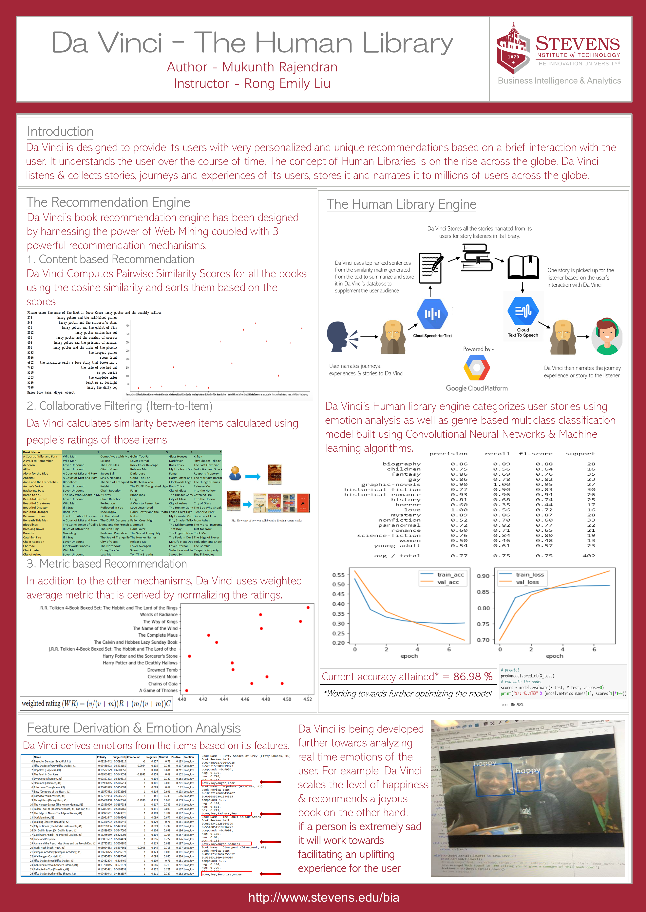

# Da Vinci - The Human Library
Da Vinci designed to provide its users with very personalized and unique recommendations based on a brief interaction with the user. It understands theuser over the course of time. The concept of Human Libraries is on the rise across the flobe. Da Vinci lintens & collects tories, journeys and experiences of its users, stores it and narrates it to millions of users across the globe.

## Authors

* **Mukunth Rajendran** 
(https://github.com/MukunthR)
* **Data Scraped from**
[GoodReads](https://www.goodreads.com)

## Project Poster

## Project Development Dependencies
* **sklearn**
* **nltk**
* **scipy**
* **numpy**
* **pandas**
* **seaborn**
* **matplotlib**

## Dependencies Installation
`pip install sklearn nltk scipy numpy pandas seaborn marplotlib`

[Project Working](https://www.youtube.com/watch?v=922gBR8Vwg8)

  
